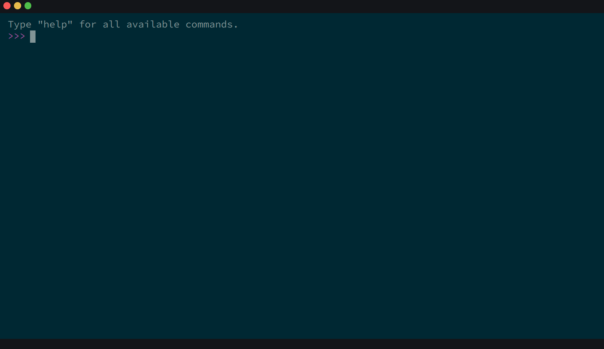

# react-terminal-plus

<p align="center">🚀 React component that renders and feels like a Terminal 🖥</p>

<p align="center">
  <a href="#features">Features</a> •
  <a href="#installation">Installation</a> •
  <a href="#usage">Usage</a> •
  <a href="#props">Props</a> •
  <a href="#development">Development</a> •
  <a href="#credits">Credits</a>
</p>



## Features

- Mobile support. 📱
- Customizable commands, prompt and error message. ✅
- Support callbacks(async/non-async) for commands. 🔄
- Command history using arrow up and down. 🔼
- Support for copy/paste through keyboard and browser's context. 📋
- Cancel running command using `Ctrl + C`. ⛔
- In-built themes and support to create more. 🚀
- Clear the terminal with `clear` command or using `Ctrl + L`. 🧹
- Local storage support for the command history. 💾
- Full TypeScript support. 🎉

## Installation

```
npm install react-terminal-plus
```

OR

```
yarn add react-terminal-plus
```

OR

```
pnpm i react-terminal-plus
```

## Usage

```tsx
import { TerminalContextProvider, ReactTerminal } from "react-terminal-plus";

function App(props) {
	// Define commands here
	const commands = {
		whoami: "jackharper",
		cd: (directory) => `changed path to ${directory}`,
	};

	return (
		<TerminalContextProvider>
			<ReactTerminal commands={commands} />
		</TerminalContextProvider>
	);
}
```

## Creating custom themes

The component comes with few in-built themes: `light`, `dark`, `material-light`, `material-dark`, `material-ocean`, `matrix` and `dracula`. You can also create custom themes by passing `themes` parameter in props, as follows:

```
<ReactTerminal
  commands={commands}
  themes={{
    "my-custom-theme": {
      themeBGColor: "#272B36",
      themeToolbarColor: "#DBDBDB",
      themeColor: "#FFFEFC",
      themePromptColor: "#a917a8"
    }
  }}
  theme="my-custom-theme"
/>
```

## Props

| name                 | description                                                                                                                                                       | default      |
| -------------------- | ----------------------------------------------------------------------------------------------------------------------------------------------------------------- | ------------ |
| `welcomeMessage`     | A welcome message to show at the start, before the prompt begins. Value can be either a string or JSX                                                             | null         |
| `prompt`             | Terminal prompt                                                                                                                                                   | >>>          |
| `commands`           | List of commands to be provided as a key value pair where value can be either a string, JSX/HTML tag or callback                                                  | null         |
| `errorMessage`       | Message to show when unidentified command executed, can be either a string, JSX/HTML tag or callback                                                              | "not found!" |
| `enableInput`        | Whether to enable user input                                                                                                                                      | true         |
| `showControlBar`     | Whether to show the top control bar                                                                                                                               | true         |
| `showControlButtons` | Whether to show the control buttons at the top bar of the terminal                                                                                                | true         |
| `theme`              | Theme of the terminal                                                                                                                                             | "light"      |
| `themes`             | Themes object to supply custom themes                                                                                                                             | null         |
| `defaultHandler`     | Default handler to be used (if provided) when no commands match. Useful when you don't know list of commands beforehand/want to send them to server for handling. | null         |

## In-built commands

| command | description        |
| ------- | ------------------ |
| clear   | clears the console |
| cls     | clears the console |

## In-built shortcuts

| shortcut           | description                                                 |
| ------------------ | ----------------------------------------------------------- |
| ctrl + c           | copy OR cancel running command if there is no selected text |
| ctrl + v           | paste                                                       |
| ctrl + l           | clear the console                                           |
| ctrl + a           | moves the cursor to the beginning of the line               |
| ctrl + e           | moves the cursor to the end of the line                     |
| Home               | moves the cursor to the beginning of the line               |
| End                | moves the cursor to the end of the line                     |
| ctrl + left-arrow  | moves the cursor to the backward word                       |
| ctrl + right-arrow | moves the cursor to the forward word                        |

## Development

See [`.github/CONTRIBUTING.md`](./.github/CONTRIBUTING.md), then [`.github/DEVELOPMENT.md`](./.github/DEVELOPMENT.md).
Thanks! 💪

## Credits

This repository resulted from a [`react-terminal`](https://github.com/bony2023/react-terminal) fork, and as such we would like to thank all its contributors for creating such an amazing piece of OS software. 💖
